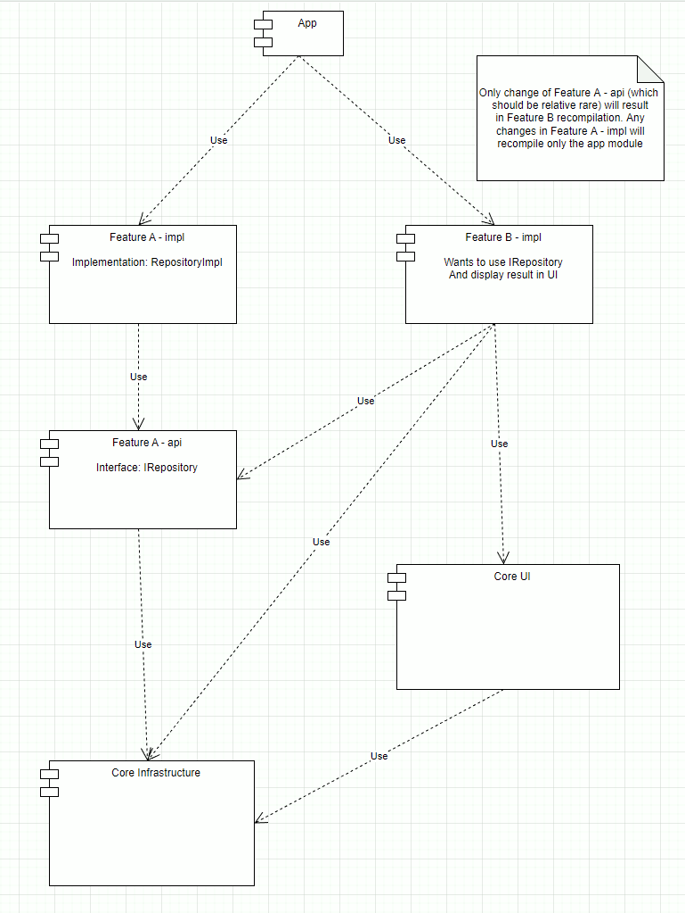

# Modularization

Every feature should be composed from (at least) 2 modules:

- Api
- Implementation

This pattern improves compilation avoidance by allowing modules to depend only on the api
modules. So implementation change won't require higher-level module to
recompile as a result.

## Template modules structure

- Core/infrastructure - all code that is reused everywhere
- Core/ui - ui-related code like base fragments, themes, colors, components and so on
- Core/models - module that will store DTO and domain models. It can also store all mapping code (MapStruct as a proposal)
- Libraries/* - set of modules to handle particular tasks (like logging, database handling and so on)
- Features/* - set of modules that will implement a single domain-bound feature
- App - top level module that will use all of above. It should be as small as possible to improve compilation avoidance and build speed as a result

## Gradle build sharing

We are using [gradle conventions](https://docs.gradle.org/current/samples/sample_convention_plugins.html) that are shared in the composite build called `build-logic`.
